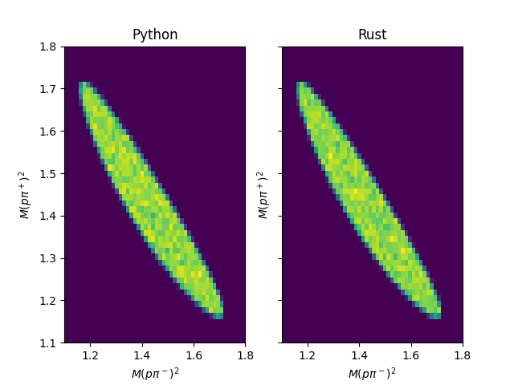

#~~Help Wanted~~
# Solved!

~~The Rust code contained here should match the operation of the Python code. I'm sure I've missed something obvious, but the results are very different.~~

All of this code mirrors that of [TGenPhaseSpace](https://root.cern.ch/doc/master/classTGenPhaseSpace.html) in the ROOT library, which is implemented in C++. The code attempts to replicate the plot made in the example given [here](https://root.cern.ch/doc/master/PhaseSpace_8C.html). The result of this code is currently given in the following plot:

~~The question is, what part of the code is leading to these clearly different results? If you fix the random values generated to a particular value, I've found that I get the same resulting vectors in both programs. Additionally, I don't see any clear bias in either random generator, and the Rust code does seem able to access all of the available phase space, it just favors one half of it for some reason.~~

~~If you know the solution, please let me know in a PR or an issue.~~

The issue described above was due to the incorrect generation of the random vector which splits the energy budget. See the last commit.
